# KC Client

<p align="center">
  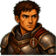
  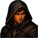
  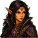
  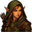
  &nbsp;&nbsp;
  
  
  
  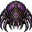
</p>

<p align="center">
  A <strong>Godot 4.6</strong> desktop client for <a href="https://github.com/GoMudEngine/GoMud">GoMud</a> / Keg's Catacombs.<br>
  WebSocket · Full GMCP · RPG equipment UI · Live room map · Portrait art
</p>

---

## Features

| Feature | Description |
|---|---|
| **RPG Inventory & Equipment** | Click-to-equip backpack grid and worn equipment slots, each slot resolved to a local item icon |
| **Live Room Map** | Tile-based map rendered from `Room.Info` GMCP, with persistent map history |
| **Character Status Bar** | Compact HP / SP / XP / Gold strip updated in real-time from `Char.Vitals` |
| **Skills & Spells** | Browseable panels from `Char.Skills` and parsed spell tables |
| **Active Effects** | Popup from `Char.Affects` |
| **Kill Stats** | Statistics panel from `Char.Kills` |
| **Room Objects** | NPC / mob list per room with portrait images |
| **Item Context Menu** | Look, Inspect, Equip, Drink / Eat / Use, Drop — targeting by full GMCP item id |
| **Player & Mob Portraits** | Per race/class player portraits; per-mob portraits; both extensible with a PNG drop |
| **GMCP Debug Log** | JSON Lines log of all GMCP inbound/outbound traffic |

### Item Icons

<p>
  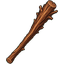
  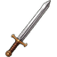
  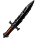
  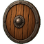
  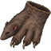
  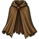
  
  
</p>

Drop a PNG at `assets/items/by_id/<item_id>.png` — no code changes needed.

### Portraits

<table>
<tr>
<th>Players</th>
<th>NPCs & Mobs</th>
</tr>
<tr>
<td>
  
  
  
  
</td>
<td>
  
  
  
  
</td>
</tr>
</table>

---

## Quick Start

1. Open this folder with **Godot 4.6.1** or newer.
2. Set the main scene to `res://main.tscn` and run.
3. WebSocket auto-connect is **disabled** by default. Click **Connect** in the status area, or type any MUD command — the client connects and queues it automatically.

### Connection Commands

| Command | Action |
|---|---|
| `/connect` | Connect to the default server |
| `/connect official` | Connect to the official GoMud server |
| `/connect catacombs` | Connect to Keg's Catacombs |
| `/connect wss://host/ws` | Connect to a custom server (raw WebSocket URL) |
| `/disconnect` | Close the socket |

Website-style URLs are accepted too — `https://gomud.net/` and `gomud.net` both normalise to `wss://gomud.net/ws`.

---

## GMCP UI Commands

After login these commands render from the cached GMCP state and trigger a GMCP refresh:

| Command | GMCP Source |
|---|---|
| `eq` / `equipment` / `i` / `inv` / `inventory` | `Char.Inventory` |
| `status` / `score` | `Char` |
| `skills` / `jobs` | `Char.Skills` + `Char.Jobs` |
| `affects` / `effects` | `Char.Affects` |
| `kills` / `killstats` | `Char.Kills` |

Legacy ANSI text remains the fallback for commands that do not yet have a confirmed GMCP payload.

---

## Architecture

```
main.tscn / main.gd              root scene · signal wiring · gmcp_state dict
connection.gd                    WebSocket lifecycle · GMCP / SOUND / text token parsing
text_processor.gd                ANSI → BBCode · MUD layout detection
scripts/text/ansi_parser.gd
scripts/text/mud_layout_detector.gd
scripts/ui/draggable_panel.gd    shared draggable popup with viewport clamping

map.tscn    / map.gd             tile-based room map from Room.Info
status.tscn / status.gd          compact HP/SP/XP/Gold bar
mobs.tscn   / mobs.gd            room objects / NPC card list
Input.tscn  / input.gd           command text input
Containers.tscn / containers.gd  backpack · equipment · score · skills · spells · popups
```

**GMCP topic → panel**

| Topic | Panel |
|---|---|
| `Room.Info` | Map + Mobs |
| `Char.Vitals` / `Char.Worth` | Status bar |
| `Char.Inventory.Backpack` | Backpack grid |
| `Char.Inventory.Worn` | Equipment slots |
| `Char.Info` | Score popup |
| `Char.Skills` / `Char.Jobs` | Skills popup |
| `Char.Affects` | Affects popup |
| `Char.Kills` | Kill stats popup |

---

## Adding Assets

### Item Icons

1. Drop a PNG at `assets/items/by_id/<item_id>.png` — e.g. `assets/items/by_id/10001.png`.
2. Resolution order at runtime:
   1. `assets/items/by_id/<item_id>.png`
   2. `assets/items/default_item.png`
3. Empty equipment slots use `assets/items/empty_slot.png`.
4. No `.import` file yet? The client falls back to a direct disk PNG load automatically.

See [`developer_tools/docs/ITEM_ICONS.md`](developer_tools/docs/ITEM_ICONS.md) for full conventions.

### Mob Portraits

Drop a PNG at `assets/mobs/by_name/<normalized_name>.png` (spaces → underscores, all lowercase). Falls back to `assets/mobs/default_mob.png` when no match is found.

### Player Portraits

Drop a PNG at `assets/player_portraits/by_race_class/<race>_<class>.png` — e.g. `human_warrior.png` or `elf_sorcerer.png`.

---

## Developer Tools

**Generate placeholder item icons** for all GoMud default-world items:

```powershell
powershell -NoProfile -ExecutionPolicy Bypass -File .\developer_tools\tools\generate_item_icons.ps1
```

**Generate AI image-generation prompts** for item PNGs:

```powershell
powershell -NoProfile -ExecutionPolicy Bypass -File .\developer_tools\tools\generate_item_icon_prompts.ps1
```

**Smoke check** — loads `main.tscn` headlessly, verifies key nodes and signal contracts, confirms no auto-connect to production on startup:

```powershell
& 'C:\Godot\Godot_v4.6.1-stable_win64_console.exe' --path . --headless --script res://tools/smoke_check.gd
```

---

## GMCP Debug Log

Enabled by default in `connection.gd`.

| | |
|---|---|
| **Primary path** | `developer_tools/logs/gmcp_debug.log` |
| **Fallback path** | `user://gmcp_debug.log` |
| **Format** | JSON Lines — GMCP inbound/outbound + connection open/close events |
| **Mode** | Append-only (new sessions do not overwrite old entries) |
| **Privacy** | Login text and submitted commands are never written; passwords are safe |

---

## GoMud WebSocket Notes

- WebSocket clients connect to `/ws`; GoMud treats them as `WebClient` (GMCP-enabled) connections.
- **Server → client** GMCP is text-wrapped: `!!GMCP(<namespace> <json>)`
- **Client → server** GMCP uses the same wrapper: `!!GMCP(Room.Info)` or `!!GMCP(Help train)`
- Do **not** send GMCP requests immediately on socket open — GoMud installs the WebSocket GMCP handler after login. Sending `!!GMCP(...)` during the login sequence will be consumed as prompt input.
- Raw telnet GMCP uses IAC/SB option `201`; this client follows the WebSocket text protocol only.
